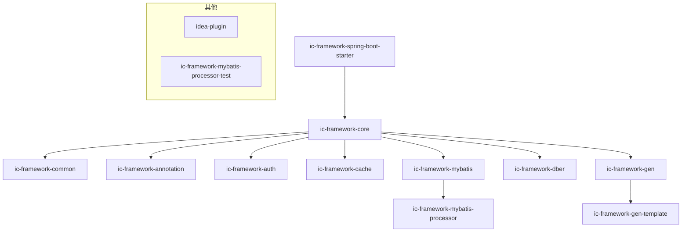

# IC Framework 架构说明

IC Framework 是一个面向中后台、App、小程序等多端的集成开发脚手架，采用模块化设计，便于扩展和维护。下文梳理各模块功能、依赖关系及整体架构。

## 1. 模块总览

- **ic-framework-annotation**：通用注解定义
- **ic-framework-auth**：权限认证体系
- **ic-framework-cache**：缓存接口与实现（本地/Redis/统一）
- **ic-framework-common**：通用工具、常量、配置
- **ic-framework-core**：核心基础设施、异常、配置
- **ic-framework-dber**：数据库增强与表结构管理
- **ic-framework-gen**：代码生成器（Java/Vue）
- **ic-framework-mybatis**：MyBatis 增强
- **ic-framework-mybatis-processor**：MyBatis 注解处理器
- **ic-framework-spring-boot-starter**：一键集成 starter
- **ic-framework-gen-template**：代码生成模板
- **ic-framework-mybatis-processor-test**：处理器测试
- **idea-plugin**：IDEA 插件

## 2. 依赖关系与调用流程

## 3. 各模块功能简介

- **annotation**：定义如 ApiCache、Author 等通用注解，供其他模块使用。
- **auth**：提供权限认证、用户体系、权限注解（如 RequireAuth、PermissionInit）。
- **cache**：统一缓存接口，支持本地、Redis 等多种实现。
- **common**：常用工具类、常量、枚举、全局配置。
- **core**：核心基础设施，异常处理、配置、工具方法。
- **dber**：数据库表结构管理、DDL 辅助。
- **gen**：代码生成器，支持 Java/Vue 等多端代码生成。
- **mybatis**：MyBatis 增强，注解、构建器、缓存、解析等。
- **spring-boot-starter**：一键集成所有核心模块。
- **gen-template**：代码生成模板。
- **mybatis-processor**：MyBatis 注解处理器。
- **mybatis-processor-test**：处理器测试。
- **idea-plugin**：IDEA 插件开发。

## 4. 架构特点

- 模块化、可插拔
- 支持多端集成
- 内置权限、缓存、代码生成等常用能力
- 适合中后台、App、小程序等场景

---

> 如需详细了解某个模块，请参考对应文档或源码。

