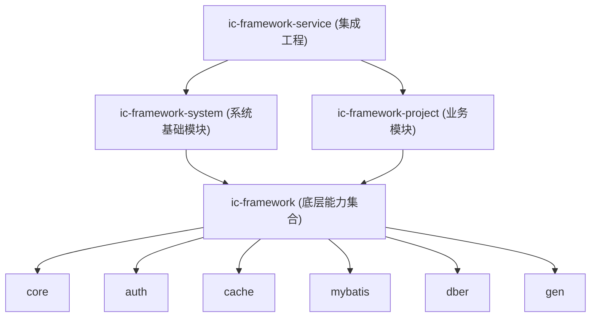

# IC Framework 项目结构

第一次看这个仓库，最容易混淆的是：到底哪个是框架，哪个是示例项目，平时开发主要改哪里。

这页就只解决这个问题。

## 1. 先分清两个层次

### `ic-framework`

这是底层框架仓库，里面放的是能力模块，比如：

- `ic-framework-core`
- `ic-framework-auth`
- `ic-framework-cache`
- `ic-framework-mybatis`
- `ic-framework-dber`
- `ic-framework-gen`

它回答的是“框架提供了什么能力”。

### `ic-framework-service`

这是基于框架做出来的集成工程，里面已经把 system 模块、project 模块、前端工程都组织好了。

它回答的是“业务项目应该怎么落地”。

大多数开发者实际日常工作的主战场，通常是 `ic-framework-service`。

## 2. 平时开发最常接触哪些目录

### 在 `ic-framework` 里

- `ic-framework-core`：基础开发骨架
- `ic-framework-auth`：认证和权限
- `ic-framework-cache`：缓存抽象
- `ic-framework-mybatis`：查询增强
- `ic-framework-dber`：实体 DDL、升级脚本
- `ic-framework-gen`：代码生成器
- `ic-framework-mybatis-processor`：APT 生成 def 文件

### 在 `ic-framework-service` 里

- `ic-framework-system`：系统基础模块
- `ic-framework-project`：你的业务模块落点
- `_web/admin`：后台前端
- `app` / `uni`：移动端与小程序方向

## 3. 推荐你这样理解模块关系

```mermaid
graph TD
  A["ic-framework-service (集成工程)"] --> B["ic-framework-system (系统基础模块)"]
  A --> C["ic-framework-project (业务模块)"]
  B --> D["ic-framework (底层能力集合)"]
  C --> D
  D --> D1["core"]
  D --> D2["auth"]
  D --> D3["cache"]
  D --> D4["mybatis"]
  D --> D5["dber"]
  D --> D6["gen"]
```

## 4. 每层主要负责什么

### 底层框架模块

- `core`：基础父类、统一开发骨架
- `auth`：JWT、鉴权注解、权限体系接口
- `cache`：统一缓存能力
- `mybatis`：实体映射、Wrapper、复杂查询、结果映射
- `dber`：自动建表、DDL 变更、升级脚本
- `gen`：生成 Java / Vue 代码

### system 模块

`ic-framework-system` 不是“示例代码”，而是一组可复用的系统基础能力：

- 用户
- 角色
- 权限
- 菜单
- 部门
- 岗位
- 在线用户
- 文件
- 通知

如果你的项目需要这些能力，通常直接复用它，而不是自己从零搭。

### project 模块

`ic-framework-project` 是你扩展业务的地方。最常见的工作流就是：

1. 在 `project` 里写实体
2. 生成 API / Service / Mapper / WrapperBuilder / 前端页面
3. 在现有 `system` 能力基础上补业务模块

## 5. 开发时应该先看哪里

如果你是要开始写业务，不建议先钻所有底层模块源码。更合理的顺序是：

1. 看 [/docs/start/import](/docs/start/import) 把工程跑起来
2. 看 [/docs/start/java](/docs/start/java) 理解一个业务模块的结构
3. 看 [/docs/system/system](/docs/system/system) 理解 system 提供了什么
4. 看 [/docs/ic-mybatis/query](/docs/ic-mybatis/query) 和 [/docs/ic-mybatis/query-dif](/docs/ic-mybatis/query-dif)

## 6. 一句话记忆

- `ic-framework`：能力库
- `ic-framework-system`：现成系统基础层
- `ic-framework-project`：你的业务代码落点
